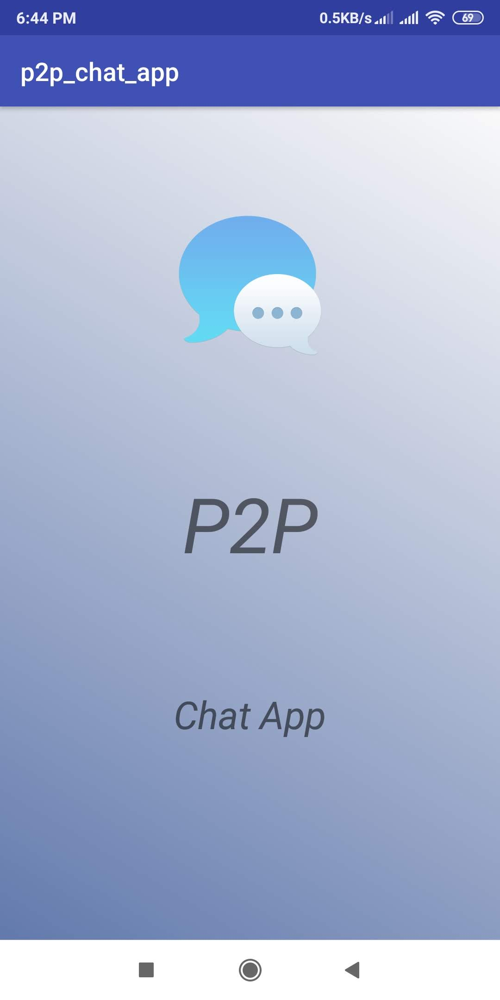
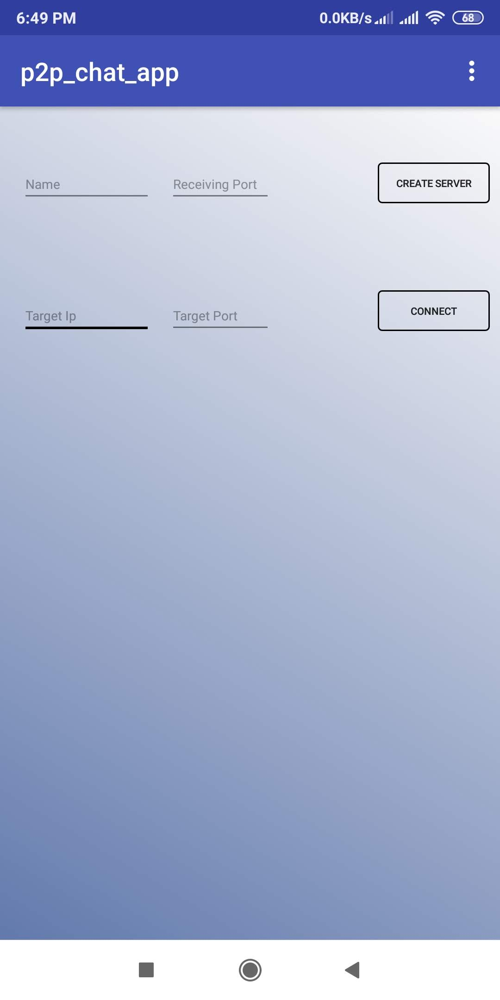
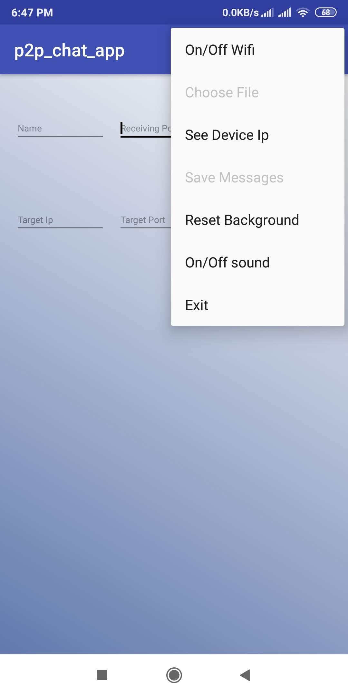
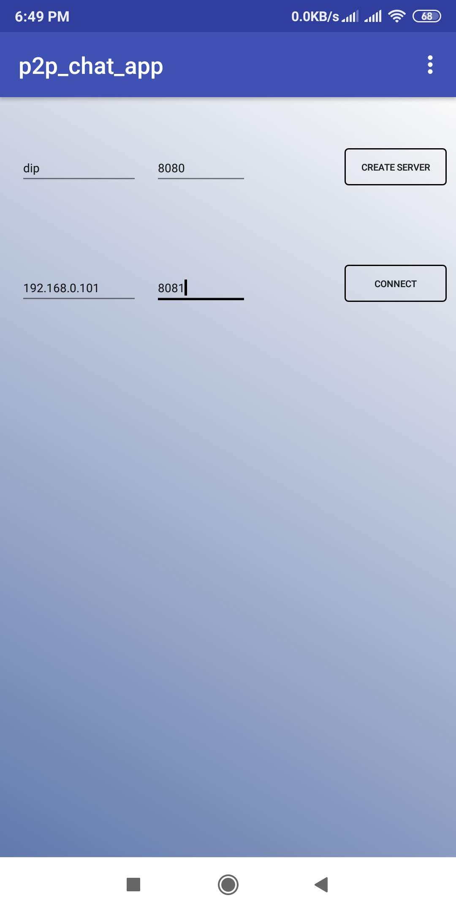
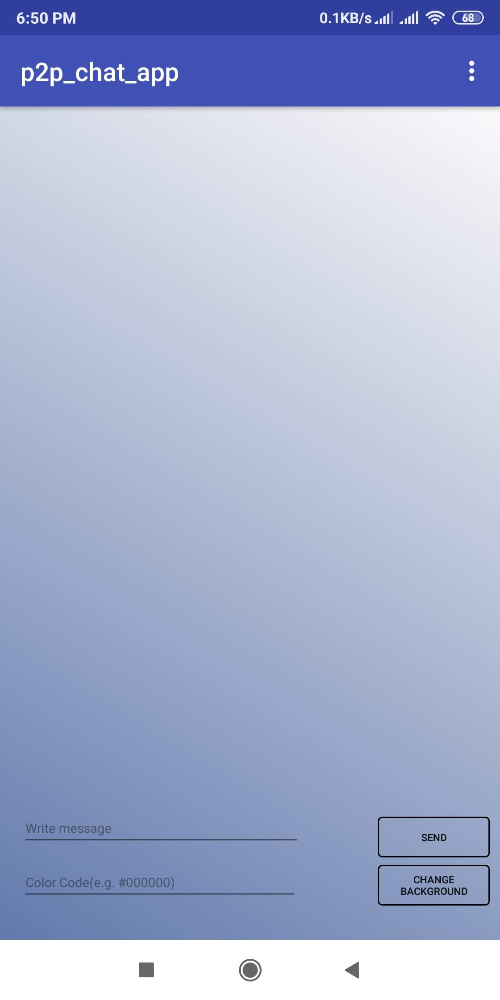
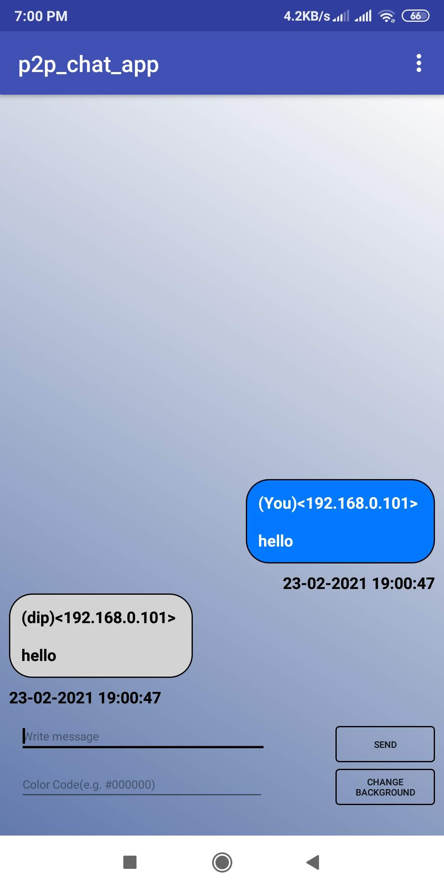
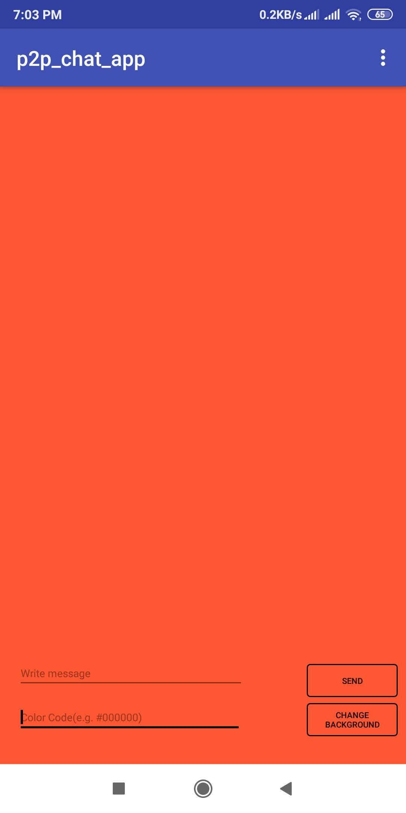
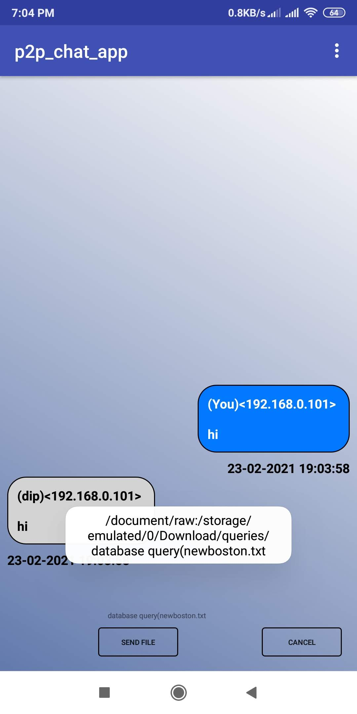

# P2p_chat_app_using_Socket_Programming

 

## Intro
It was developed as a part of the coursework for Computer Networking lab course (3/2)

## About App
Using this app you can chat with others who are connected in a same network.
Just you have to know their Ip addresses and the Port addresses they are using to create server.

Features: 

-Messaging

-Textual File Sharing

-Background Color Control of Own Device as well as remote users.

-Saving Messages

**Some SS from Our Chat App:**

 
 
 
 

